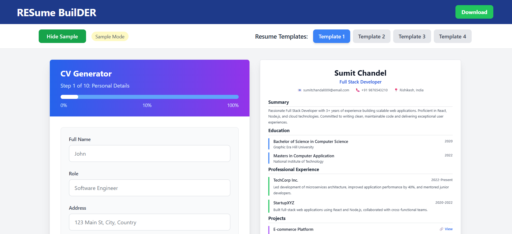
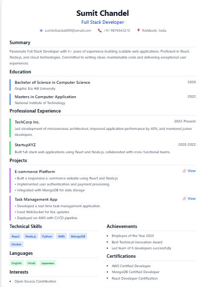

# 📝 Resume Maker

A simple and interactive Resume (CV) Generator built using **React.js**. Users can enter personal details, education, experience, and skills to instantly preview and download a beautiful resume.

---

## 🚀 Features

- 🧑‍💼 Details input
- 🎓 Variety of resume template
- 💡 Skills listing
- 📄 Live preview
- 📥 Download as PDF (coming soon / implemented)
- 💾 Data persistence (optional: localStorage)

---

## 🛠️ Tech Stack

- React.js
- Tailwind css

---

## 📸 Screenshots


### 🏠 Home Page


### 📄 Resume Preview

---

## 🔧 Installation

```bash
git clone https://github.com/yourusername/resume-maker.git
cd resume-maker
npm install
npm run dev  
